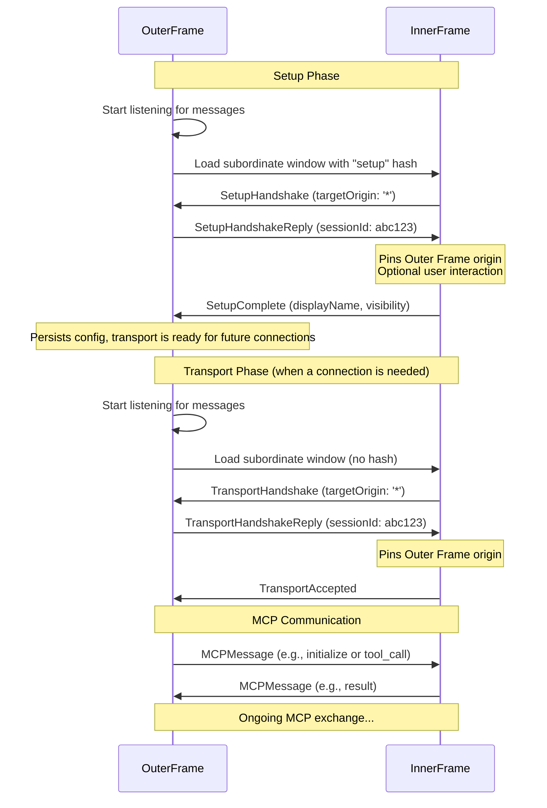

# SEP: postMessage Transport

## Preamble

**Title:** postMessage Transport
**Author:** Josh Mandel (@jmandel)
**Status:** Proposal
**Type:** Standards Track
**Created:** 2025-07-19
**Reference Implementation:** [Demo](https://jmandel.github.io/mcp-postmessage) | [Source](https://github.com/jmandel/mcp-postmessage)


## Abstract

This SEP proposes a postMessage transport for the Model Context Protocol (MCP) that enables secure communication between clients and servers running in different browser contexts (iframes or popup windows). The transport leverages the browser's `window.postMessage` API to provide zero-installation MCP connections with support for a two-phase connection model: a one-time setup phase for configuration and authentication, and a transport phase for ongoing MCP communication. This approach enables new use cases including direct access to browser-sandboxed APIs, edge computing for privacy-sensitive applications, and rich user interfaces for MCP tools.

## Motivation

Current MCP transports require either local installation or remote server processing, creating fundamental barriers to adoption and new capabilities:

**Installation Barriers**: MCP servers require software installation, creating security risks from running untrusted code with system access and limiting reach to users who are willing to ignore these risks or have the technical expertise to mitigate them.

**Privacy Trade-offs**: Processing sensitive data forces users to choose between allowing the data to be hosted on remote servers or installing local software.

**Limited UX**: MCP interactions are confined to text-based exchanges, preventing rich interactive experiences and progressive enhancement of client interfaces through embedded server UX.

## Design Principles

This transport enables four transformative capabilities:

**Zero Installation**: Servers distributed as URLs eliminate installation friction and security risks, enabling instant access to MCP capabilities in browser-sandboxed environments.

**Privacy-First Processing**: Browser-local execution ensures sensitive data can stay on the user's device, enabling new classes of privacy-preserving AI tools.

**Progressive UX Enhancement**: Servers can embed rich interactive interfaces directly in client applications, transforming MCP from text-based to visually enhanced experiences.

**Edge Computing**: Computation occurs in the user's browser context, reducing latency and server costs while improving data locality.

### Core Concepts

The postMessage transport is designed around two key sets of roles: the **Window Hierarchy** and the **MCP Protocol Roles**. Understanding their separation is crucial.

#### Window Hierarchy Roles (Physical Layer)
This describes the browser window relationship, which is what the transport components are built on.

*   **Outer Frame**: The main, controlling window. It embeds and manages the other window.
*   **Inner Frame**: The subordinate, controlled window, typically an `<iframe>` or a popup.

#### MCP Protocol Roles (Logical Layer)
This describes the roles defined by the Model Context Protocol itself.

*   **MCP Client**: The entity that initiates actions by calling tools.
*   **MCP Server**: The entity that provides tools and responds to `tools/list`.

### Supported Architectures

By separating the window hierarchy from MCP roles, the transport supports two powerful patterns:

#### Standard Architecture (Client-in-Control)
*   **Outer Frame**: MCP Client
*   **Inner Frame**: MCP Server
*   **Use Case**: A primary application (like a chat client) embeds and consumes tools from third-party services.

#### Inverted Architecture (Server-in-Control)
*   **Outer Frame**: MCP Server
*   **Inner Frame**: MCP Client
*   **Use Case**: A primary application (like a user dashboard) provides contextual data as tools to an embedded, sandboxed AI copilot.

| Transport Feature         | Standard Architecture (e.g., Demo Client)      | Inverted Architecture (e.g., User Dashboard)   |
|---------------------------|------------------------------------------------|------------------------------------------------|
| **Outer Frame Role**      | MCP Client                                     | MCP Server                                     |
| **Inner Frame Role**      | MCP Server                                     | MCP Client                                     |
| **Who provides tools?**   | Inner Frame                                    | Outer Frame                                    |
| **Who calls tools?**      | Outer Frame                                    | Inner Frame                                    |

## Specification

### Protocol Overview

The postMessage transport defines two distinct phases:

1. **Setup Phase**: One-time configuration when adding a server to the client
2. **Transport Phase**: Repeated connections for MCP communication

Each phase has its own handshake protocol. Servers detect the current phase via URL hash parameters: setup phase uses `#setup` hash on the server URL (e.g., `https://example.com/mcp-server#setup`) while transport phase uses the base URL with no hash parameter.

**Note**: The setup phase is always required in terms of protocol steps, but can be transparent to users. Servers can immediately respond with a handshake completion, making setup instantaneous without interrupting UX or requiring user interaction.

The protocol implements strict origin-based security using browser MessageEvent origins, with all security relying on validating `event.origin` - the only trusted source of origin information in postMessage.

### Message Flows

To avoid race conditions, the Outer Frame should always begin listening for messages *before* navigating the Inner Frame. This ensures no messages from the Inner Frame are missed.



### Message Types

All protocol messages include a `type` field with prefix `MCP_`. The protocol defines eight message types across two phases:

#### Setup Phase Messages (3 messages)

**1. SetupHandshake** (Inner Frame → Outer Frame)

**Context**: The Outer Frame has created a subordinate window (Inner Frame) and navigated it to a URL with a `#setup` hash. The code in the Inner Frame detects this and initiates the setup phase by sending this message.

**TARGET ORIGIN**: The Inner Frame must use `'*'` because it cannot know the origin of its parent/opener at this stage. This is the only message where the initiating party uses a wildcard target origin.

```typescript
export interface SetupHandshakeMessage {
  type: 'MCP_SETUP_HANDSHAKE';
  
  /** Version of the PostMessage transport protocol this server supports */
  protocolVersion: '1.0';
  
  /** Whether the server needs to show UI during setup */
  requiresVisibleSetup: boolean;
}
```

**2. SetupHandshakeReply** (Outer Frame → Inner Frame)

**Context**: The Outer Frame receives the `SetupHandshakeMessage` and replies to confirm its willingness to proceed with setup. If `requiresVisibleSetup` was true, the Outer Frame is responsible for making the Inner Frame visible.

**TARGET ORIGIN**: The Outer Frame uses the origin of the Inner Frame, which it knows from the iframe's `src` or the popup's URL.

**SECURITY**: Upon receiving this message, the Inner Frame must:
1. Validate that `event.origin` matches the expected Outer Frame's origin.
2. Pin `event.origin` for all subsequent communication in this session.

```typescript
export interface SetupHandshakeReplyMessage {
  type: 'MCP_SETUP_HANDSHAKE_REPLY';
  
  /** 
   * Protocol version the client supports - allows for version negotiation
   * The server can reject if incompatible
   */
  protocolVersion: '1.0';
  
  /** 
   * Unique identifier for this connection instance.
   * The MCP Client provides this ID, and the MCP Server uses it to
   * scope any persistent storage (e.g., localStorage).
   */
  sessionId: string;
}
```

**3. SetupComplete** (Inner Frame → Outer Frame)

**Context**: The setup process within the Inner Frame is complete (e.g., user authenticated, configuration set). The Inner Frame sends this final message to the Outer Frame, which can then persist the configuration and close or hide the setup window.

**TARGET ORIGIN**: The Inner Frame uses the pinned origin of the Outer Frame.

```typescript
export interface SetupCompleteMessage {
  type: 'MCP_SETUP_COMPLETE';
  
  /** Whether setup succeeded or failed */
  status: 'success' | 'error';
  
  /** 
   * A user-facing name for the inner frame's application.
   * In the Standard Architecture, this is the MCP Server's title (e.g., "Pi Calculator").
   * In the Inverted Architecture, this could be the MCP Client's title (e.g., "AI Copilot").
   * This appears in the Outer Frame's UI.
   */
  displayName: string;
  
  /** 
   * Optional message to briefly show the user (toast/notification style)
   * Examples: "Successfully authenticated!", "Configuration saved"
   */
  ephemeralMessage?: string;
  
  /** 
   * Visibility behavior during transport phase
   */
  transportVisibility: {
    /** 
     * Visibility requirement:
     * - 'required': Server must be visible (e.g., shows live visualizations)
     * - 'optional': User can choose (e.g., can show logs but not necessary)
     * - 'hidden': Server should stay hidden (most common case)
     */
    requirement: 'required' | 'optional' | 'hidden';
    
    /**
     * If `requirement` is 'optional', this user-facing string describes
     * the benefit of keeping the transport visible. The Outer Frame's UI
     * should display this next to a show/hide control.
     *
     * @example "Show to see live diagram previews."
     */
    description?: string;
  };
  
  /** If status is 'error', details about what went wrong */
  error?: {
    code: 'USER_CANCELLED' | 'AUTH_FAILED' | 'TIMEOUT' | 'CONFIG_ERROR';
    message: string;
  };
}
```

#### Transport Phase Messages (5 messages)

The transport phase includes both handshake messages for establishing connection and runtime messages for ongoing operation.

**Connection Handshake:**

**4. TransportHandshake** (Inner Frame → Outer Frame)

**Context**: The Outer Frame has created a subordinate window (Inner Frame) for an active transport session (i.e., no `#setup` hash). The Inner Frame initiates the connection by sending this message.

**TARGET ORIGIN**: The Inner Frame must use `'*'` because, as a new window instance, it does not yet know its controller's origin.

```typescript
export interface TransportHandshakeMessage {
  type: 'MCP_TRANSPORT_HANDSHAKE';
  
  /** Protocol version for compatibility checking */
  protocolVersion: '1.0';
}
```

**5. TransportHandshakeReply** (Outer Frame → Inner Frame)

**Context**: The Outer Frame receives the `TransportHandshakeMessage` and replies with the `sessionId` for this connection, authorizing the transport to begin.

**TARGET ORIGIN**: The Outer Frame uses the Inner Frame's origin.

**SECURITY**: Upon receiving this message, the Inner Frame must:
1. Validate that `event.origin` is an allowed origin.
2. Pin `event.origin` for all subsequent messages in this session.

```typescript
export interface TransportHandshakeReplyMessage {
  type: 'MCP_TRANSPORT_HANDSHAKE_REPLY';
  
  /** 
   * Unique identifier for this connection instance.
   * The MCP Client provides this ID, and the MCP Server uses it to
   * scope any persistent storage (e.g., localStorage).
   */
  sessionId: string;
  
  /** Protocol version for compatibility checking */
  protocolVersion: '1.0';
}
```

**6. TransportAccepted** (Inner Frame → Outer Frame)

**Context**: The Inner Frame has received the handshake reply, validated the Outer Frame's origin, and is now ready for MCP communication. This message signals to the Outer Frame that the transport is fully established.

**TARGET ORIGIN**: The Inner Frame uses the pinned origin of the Outer Frame.

```typescript
export interface TransportAcceptedMessage {
  type: 'MCP_TRANSPORT_ACCEPTED';
  
  /** Echo back the session ID to confirm */
  sessionId: string;
}
```

**Runtime Operation:**

**7. SetupRequired** (Inner Frame → Outer Frame) (Optional)

**Context**: During an active session, the Inner Frame determines it needs to re-run the setup phase. For example:
- OAuth token has expired
- API key is no longer valid  
- Server configuration has changed
- User permissions have changed

The Outer Frame should prompt the user to re-run setup for this server.

**TARGET ORIGIN**: The Inner Frame uses the pinned origin from the session.

```typescript
export interface SetupRequiredMessage {
  type: 'MCP_SETUP_REQUIRED';
  
  /** Why setup is needed again */
  reason: 'AUTH_EXPIRED' | 'CONFIG_CHANGED' | 'PERMISSIONS_CHANGED' | 'OTHER';
  
  /** Human-readable explanation */
  message: string;
  
  /** 
   * Whether the current session can continue working
   * - true: Session works but setup recommended soon
   * - false: Session will fail, setup required immediately
   */
  canContinue: boolean;
}
```

**8. MCPMessage** (Bidirectional)

**Context**: After `TransportAccepted`, all MCP protocol messages are wrapped in this message type. This allows the transport to distinguish between transport control messages and MCP protocol messages.

**TARGET ORIGIN**: Both parties use their respective pinned origins.

```typescript
export interface MCPMessage {
  type: 'MCP_MESSAGE';
  
  /** The complete MCP JSON-RPC 2.0 message */
  payload: {
    jsonrpc: '2.0';
    id?: string | number;
    method?: string;
    params?: any;
    result?: any;
    error?: any;
  };
}
```

### Security Implementation

#### MCP Server Security

**Note**: Security policies like `allowedOrigins` are configured on the entity acting as the **MCP Server**. The transport's job is to securely deliver the `event.origin` of the **MCP Client** so the server can validate it.

- **MCP Server Setup**: Maintain an explicit allowed origins list for your server.
- **Message Validation**: Always validate using `event.origin` from the MessageEvent.
- **Anti-Spoofing**: Never trust origin information from message payloads - only use `event.origin`.
- **Allowlist Enforcement**: Reject messages from origins not in your allowed list.

#### Target Origin Protocol
1. **Inner Frame's First Message**: Use `targetOrigin: '*'` for initial handshake (the Inner Frame doesn't know the Outer Frame's origin yet).
2. **Origin Pinning**: After receiving the Outer Frame's first message, the Inner Frame must pin the `event.origin` value.
3. **Subsequent Messages**: The Inner Frame uses only the pinned origin for all future messages to the Outer Frame.
4. **Outer Frame Behavior**: The Outer Frame always uses the Inner Frame's origin (from the iframe URL) as `targetOrigin`.

#### Message Processing Security
- Ignore messages from unexpected origins
- Ignore messages with unexpected message types
- Validate message structure before processing
- Implement timeout handling for handshake phases

### Configuration Persistence

During setup phase, servers can store session-scoped configuration using browser APIs:
```javascript
// Server receives sessionId during setup handshake
// and uses it to scope storage keys
const storageKey = `mcp-api-key-${sessionId}`;

// Server saves API key during setup
localStorage.setItem(storageKey, apiKey);

// Server retrieves it during transport phase using same sessionId
const apiKey = localStorage.getItem(storageKey);
```

### Transport Integration

After handshakes complete, MCP protocol messages are exchanged using the MCPMessage wrapper:

```typescript
// Client sends MCP initialize request
{
  type: 'MCP_MESSAGE',
  payload: {
    jsonrpc: '2.0',
    id: 1,
    method: 'initialize',
    params: {
      protocolVersion: '2024-11-05',
      capabilities: {}
    }
  }
}

// Server sends MCP response
{
  type: 'MCP_MESSAGE',
  payload: {
    jsonrpc: '2.0',
    id: 1,
    result: {
      protocolVersion: '2024-11-05',
      capabilities: {},
      serverInfo: {
        name: 'example-server',
        version: '1.0.0'
      }
    }
  }
}
```

The MCPMessage wrapper allows the transport to distinguish MCP protocol messages from transport control messages. The payload contains the complete JSON-RPC 2.0 message as defined by the MCP specification.

### Session Management

Session management is orchestrated by the **MCP Client**, which generates and provides the `sessionId`. The **MCP Server** uses this ID to scope its persistent storage, ensuring data isolation between connections.

**Cross-Phase Workflow**: The typical flow works as follows:
1. **Setup Phase**: Client provides sessionId during setup handshake
2. **Server Storage**: Server stores configuration data (API keys, preferences, etc.) scoped by sessionId
3. **Transport Phase**: Client provides the same sessionId during transport handshake
4. **Data Retrieval**: Server uses sessionId to retrieve the previously stored configuration for that specific connection

**Data Isolation**: Session IDs enable servers to maintain separate storage and context for different connections, supporting scenarios like a single user having multiple independent sessions each operating with different configuration.


**Implementation Example**: Here's one way servers can use sessionId for cross-phase data persistence (this is implementation advice, not a protocol requirement):

```javascript
// During setup phase - example storage pattern
const configKey = `server-config-${sessionId}`;
localStorage.setItem(configKey, JSON.stringify({apiKey, preferences}));

// During transport phase - example retrieval pattern
const config = JSON.parse(localStorage.getItem(`server-config-${sessionId}`));
```

**Session Continuity**: The Outer Frame can reuse session IDs across Inner Frame reloads, allowing the Inner Frame to restore previous state and maintain continuity across page refreshes or navigation events.


## Use Cases

### Local File Access

Web-based servers can provide file access using the File System Access API:
- AI assistants work with local files without uploads
- Data never leaves the user's device
- Full read/write capabilities with user permission

### Privacy-Preserving Edge Computing  

Healthcare and financial applications process sensitive data locally:
- Patient records analyzed entirely in-browser
- Complex computations using WebAssembly
- No data transmission to external servers

### Interactive Visualization Tools

Servers provide rich UI tools:
- Diagram editors (like mermaid.live)
- Data visualization dashboards  
- Interactive form builders
- Real-time collaboration interfaces

## Backwards Compatibility

As a new transport mechanism, the postMessage transport introduces no backwards compatibility issues. Existing MCP implementations using stdio or HTTP SSE transports continue to function unchanged. Clients and servers must explicitly opt into using the postMessage transport.

## Reference Implementation

A complete reference implementation demonstrating all protocol features is available at https://github.com/jmandel/mcp-postmessage. A hosted demo of the implementation can be accessed at https://jmandel.github.io/mcp-postmessage.

### Client Architecture

The demo client provides a full-featured MCP client interface that:
- **Server Management**: Add, configure, and connect to multiple PostMessage servers
- **Setup Phase Handling**: Manages both visible and hidden server setup workflows  
- **Tool Discovery**: Automatically discovers and displays available MCP tools from connected servers
- **Dynamic UI Generation**: Creates forms for tool parameters based on MCP schema definitions
- **Real-time Communication**: Handles bidirectional MCP message exchange during active sessions

### Example Servers

#### Transport Features by Example

| Transport Feature | Pi Calculator | JSON Analyzer | Mermaid Editor |
|-------------------|---------------|---------------|----------------|
| User-facing setup phase | ❌ | ✅ | ❌ |
| UI visibility at runtime | 🔄 Optional | 🚫 Hidden | 👁️ Visible |
| Partitioned storage by sessionId | ❌ | ✅ | ❌ |

The implementation includes three sample servers that demonstrate different protocol features:

**Pi Calculator Server**
- **Demonstrates**: No user-facing setup phase, optionally visible UI at runtime (hide/show buttons)
- **Use Case**: Mathematical computation with optional interactive visualization

**JSON Analyzer Server**  
- **Demonstrates**: User-facing setup phase, hidden UI at runtime, partitioned storage by sessionId
- **Use Case**: Data processing and analysis with persistent configuration

**Mermaid Editor Server**
- **Demonstrates**: No user-facing setup phase, visible UI at runtime (always shown)
- **Use Case**: Interactive diagram editing requiring constant user visibility

Each server demonstrates the complete protocol flow from setup through active MCP communication, providing practical patterns for implementers.

## Security Implications

### Validated Security Properties

1. **Origin Isolation**: Only explicitly allowed origins can establish connections
2. **Message Integrity**: PostMessage provides tamper-proof message delivery
3. **Process Isolation**: Browser contexts are isolated by default
4. **No Ambient Authority**: Each connection requires explicit handshake

### Security Considerations

1. **Iframe Sandboxing**: Clients should apply appropriate sandbox attributes
2. **Content Security Policy**: Both parties should implement restrictive CSP
3. **User Consent**: Setup phase enables explicit permission flows
4. **Data Validation**: All message contents must be validated

### Open Security Questions

1. Should the protocol include capability requirements/negotiation for sandbox restrictions?
