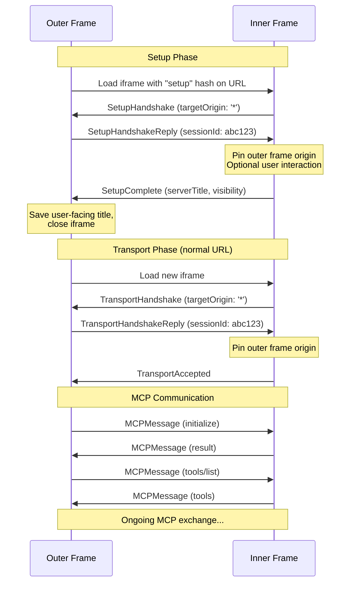

# SEP: postMessage Transport

## Preamble

**Title:** postMessage Transport  
**Author:** Josh Mandel (@jmandel)  
**Status:** Proposal  
**Type:** Standards Track  
**Created:** 2025-07-19  

## Abstract

This SEP proposes a postMessage transport for the Model Context Protocol (MCP) that enables secure communication between clients and servers running in different browser contexts (iframes or popup windows). The transport leverages the browser's `window.postMessage` API to provide zero-installation MCP connections with support for a two-phase connection model: a one-time setup phase for configuration and authentication, and a transport phase for ongoing MCP communication. This approach enables new use cases including direct access to browser-sandboxed APIs, edge computing for privacy-sensitive applications, and rich user interfaces for MCP tools.

## Motivation

Current MCP transports require either local installation or remote server processing, creating fundamental barriers to adoption and new capabilities:

**Installation Barriers**: MCP servers require software installation, creating security risks from running untrusted code with system access and limiting reach to users who are willing to ignore these risks or have the technical expertise to mitigate them.

**Privacy Trade-offs**: Processing sensitive data forces users to choose between allowing the data to be hosted on remote servers or installing local software.

**Limited UX**: MCP interactions are confined to text-based exchanges, preventing rich interactive experiences and progressive enhancement of client interfaces through embedded server UX.

## Design Principles

This transport enables four transformative capabilities:

**Zero Installation**: Servers distributed as URLs eliminate installation friction and security risks, enabling instant access to MCP capabilities in browser-sandboxed environments.

**Privacy-First Processing**: Browser-local execution ensures sensitive data can stay on the user's device, enabling new classes of privacy-preserving AI tools.

**Progressive UX Enhancement**: Servers can embed rich interactive interfaces directly in client applications, transforming MCP from text-based to visually enhanced experiences.

**Edge Computing**: Computation occurs in the user's browser context, reducing latency and server costs while improving data locality.

## Specification

### Protocol Overview

The postMessage transport defines two distinct phases:

1. **Setup Phase**: One-time configuration when adding a server to the client
2. **Transport Phase**: Repeated connections for MCP communication

Each phase has its own handshake protocol. Servers detect the current phase via URL hash parameters: setup phase uses `#setup`hash on the server URL (e.g., `https://example.com/mcp-server#setup`) while transport phase uses the base URL with no hash parameter.

**Note**: The setup phase is always required in terms of protocol steps, but can be transparent to users. Servers can immediately respond with a handshake completion, making setup instantaneous without interrupting UX or requiring user interaction.

The protocol implements strict origin-based security using browser MessageEvent origins, with all security relying on validating `event.origin` - the only trusted source of origin information in postMessage.

### Message Flows



### Supported Architectures

The PostMessage transport is designed to be flexible and supports both standard and inverted architectural patterns. The transport layer is decoupled from MCP protocol roles (Client vs Server) and instead focuses on window hierarchy position:

#### Standard Architecture
- **Outer Frame**: MCP Client (controlling window)
- **Inner Frame**: MCP Server (subordinate iframe/popup)

**Use Cases:**
- Adding third-party tools to existing AI assistants
- Embedding specialized servers into client applications
- Plugin architectures where servers provide capabilities

**Example:** A chat application embeds various tool providers (calculator, file analyzer, etc.) in iframes.

#### Inverted Architecture  
- **Outer Frame**: MCP Server (controlling window)
- **Inner Frame**: MCP Client (subordinate iframe/popup)

**Use Cases:**
- Embedding sandboxed AI assistants into main applications
- Providing AI copilots with access to application context
- Secure AI integrations where the host app controls data access

**Example:** A user dashboard application embeds an AI copilot that can query user information through MCP tools provided by the parent application.

Both architectures use the same underlying transport components, with the Outer Frame using `OuterFrameTransport` + window controls, and the Inner Frame using `InnerFrameTransport` + message controls. This design enables maximum flexibility while maintaining security and clear separation of concerns.


### Message Types

All protocol messages include a `type` field with prefix `MCP_`. The protocol defines eight message types across two phases:

#### Setup Phase Messages (3 messages)

**1. SetupHandshake** (Server → Client)

**Context**: User has clicked "Add Server" in the client UI and entered a URL. The client creates a hidden iframe pointing to the server URL with `#setup`. The server detects the setup parameter and sends this handshake message.

**Security**: This message is sent before trust is established, so it contains only the minimum information needed to proceed with setup. The server must use `'*'` as the target origin because it doesn't yet know who is framing it. This is the ONLY message where `'*'` is acceptable.

```typescript
export interface SetupHandshakeMessage {
  type: 'MCP_SETUP_HANDSHAKE';
  
  /** Version of the PostMessage transport protocol this server supports */
  protocolVersion: '1.0';
  
  /** Whether the server needs to show UI during setup */
  requiresVisibleSetup: boolean;
}
```

**2. SetupHandshakeReply** (Client → Server)

**Context**: The client has received the handshake message and validates that it can work with this protocol version. If `requiresVisibleSetup` is true, the client makes the iframe visible to the user.

**Security**: The client sends this reply to complete the mutual handshake. Upon receiving this message, the server must:
1. Check `event.origin` against its allowed origins list
2. If allowed, pin this origin for all future messages to this client
3. Never use `'*'` as target origin after this point

```typescript
export interface SetupHandshakeReplyMessage {
  type: 'MCP_SETUP_HANDSHAKE_REPLY';
  
  /** 
   * Protocol version the client supports - allows for version negotiation
   * The server can reject if incompatible
   */
  protocolVersion: '1.0';
  
  /** 
   * Unique identifier for this server connection
   * Used to isolate data storage in case of multiple connections to the same server
   */
  sessionId: string;
}
```

**3. SetupComplete** (Server → Client)

**Context**: Setup is now in progress. If visible, the server is showing its configuration UI (auth forms, option selections, etc). The user interacts with this UI until setup is complete. When setup finishes (successfully or with error), the server sends this message. The client saves the configuration data and can hide the iframe.

**Security**: The server uses the pinned origin from Step 2.

```typescript
export interface SetupCompleteMessage {
  type: 'MCP_SETUP_COMPLETE';
  
  /** Whether setup succeeded or failed */
  status: 'success' | 'error';
  
  /** 
   * Display name for this server configuration
   * Examples: "OpenAI GPT-4", "John's Health Records", "Test Database"
   * This appears in the client's server list
   */
  serverTitle: string;
  
  /** 
   * Optional message to briefly show the user (toast/notification style)
   * Examples: "Successfully authenticated!", "Configuration saved"
   */
  ephemeralMessage?: string;
  
  /** 
   * Visibility behavior during transport phase
   */
  transportVisibility: {
    /** 
     * Visibility requirement:
     * - 'required': Server must be visible (e.g., shows live visualizations)
     * - 'optional': User can choose (e.g., can show logs but not necessary)
     * - 'hidden': Server should stay hidden (most common case)
     */
    requirement: 'required' | 'optional' | 'hidden';
    
    /** 
     * If requirement is 'optional', explain the tradeoff to help user decide
     * Example: "Show server to see real-time query logs and performance metrics"
     */
    optionalMessage?: string;
  };
  
  /** If status is 'error', details about what went wrong */
  error?: {
    code: 'USER_CANCELLED' | 'AUTH_FAILED' | 'TIMEOUT' | 'CONFIG_ERROR';
    message: string;
  };
}
```

#### Transport Phase Messages (5 messages)

The transport phase includes both handshake messages for establishing connection and runtime messages for ongoing operation.

**Connection Handshake:**

**4. TransportHandshake** (Server → Client)

**Context**: User has clicked "Connect" on a previously configured server. The client creates an iframe (visible or hidden based on saved preferences) and navigates to the server URL WITHOUT `#setup` parameter. The server detects the absence of the parameter and sends this transport handshake.

**Important**: This is a different iframe instance than during setup - the server is stateless between connections.

**Security**: The server must use `'*'` because this is a fresh iframe and it doesn't know the client origin yet. This mirrors the setup phase.

```typescript
export interface TransportHandshakeMessage {
  type: 'MCP_TRANSPORT_HANDSHAKE';
  
  /** Protocol version for compatibility checking */
  protocolVersion: '1.0';
}
```

**5. TransportHandshakeReply** (Client → Server)

**Context**: The client received the handshake message and wants to establish the MCP transport connection. It sends this reply with session details. The server validates the origin using `event.origin` from the MessageEvent.

**Security**: Upon receiving this message, the server must:
1. Check `event.origin` against its allowed origins list
2. If allowed, pin this origin for all messages in this session
3. Use only the pinned origin (never `'*'`) for the rest of the session

```typescript
export interface TransportHandshakeReplyMessage {
  type: 'MCP_TRANSPORT_HANDSHAKE_REPLY';
  
  /** Unique identifier for this connection session */
  sessionId: string;
  
  /** Protocol version for compatibility checking */
  protocolVersion: '1.0';
}
```

**6. TransportAccepted** (Server → Client)

**Context**: The server has validated the client's origin and is ready to begin MCP protocol communication. After this message, both sides can exchange standard MCP messages.

**Security**: The server uses the pinned origin from Step 2.

```typescript
export interface TransportAcceptedMessage {
  type: 'MCP_TRANSPORT_ACCEPTED';
  
  /** Echo back the session ID to confirm */
  sessionId: string;
}
```

**Runtime Operation:**

**7. SetupRequired** (Server → Client, optional)

**Context**: During an active MCP session, the server realizes it needs the user to run setup again. Common scenarios:
- OAuth token has expired
- API key is no longer valid  
- Server configuration has changed
- User permissions have changed

The client should prompt the user to re-run setup for this server.

**Security**: The server uses the pinned origin from the session.

```typescript
export interface SetupRequiredMessage {
  type: 'MCP_SETUP_REQUIRED';
  
  /** Why setup is needed again */
  reason: 'AUTH_EXPIRED' | 'CONFIG_CHANGED' | 'PERMISSIONS_CHANGED' | 'OTHER';
  
  /** Human-readable explanation */
  message: string;
  
  /** 
   * Whether the current session can continue working
   * - true: Session works but setup recommended soon
   * - false: Session will fail, setup required immediately
   */
  canContinue: boolean;
}
```

**8. MCPMessage** (Bidirectional)

**Context**: After TransportAccepted, all MCP protocol messages are wrapped in this message type. This allows the transport to distinguish between transport control messages and MCP protocol messages.

**Security**: Both parties use their respective pinned origins.

**Note**: After the transport handshake is complete, the client and server exchange standard MCP protocol messages (JSON-RPC 2.0 format). All MCP messages use the pinned origins established during handshake:
- Server → Client: Uses the pinned client origin from Step 2
- Client → Server: Uses the server origin from the iframe URL

```typescript
export interface MCPMessage {
  type: 'MCP_MESSAGE';
  
  /** The complete MCP JSON-RPC 2.0 message */
  payload: {
    jsonrpc: '2.0';
    id?: string | number;
    method?: string;
    params?: any;
    result?: any;
    error?: any;
  };
}
```

### Security Implementation

#### Origin Validation Requirements

**⚠️ CRITICAL SECURITY REQUIREMENT**: Production servers MUST specify explicit allowed origins. Never use `['*']` in production as it allows any website to connect to your server.

```javascript
// ❌ INSECURE - allows any origin (demo only)
allowedOrigins: ['*']

// ✅ SECURE - explicit origins only  
allowedOrigins: ['https://my-client-app.com', 'https://localhost:3000']
```

- **Server Setup**: Maintain an explicit allowed origins list for your server
- **Message Validation**: Always validate using `event.origin` from MessageEvent
- **Anti-Spoofing**: Never trust origin information from message payloads - only use `event.origin`
- **Allowlist Enforcement**: Reject messages from origins not in your allowed list

#### Target Origin Protocol
1. **Server's First Message**: Use `targetOrigin: '*'` for initial handshake (server doesn't know client origin yet)
2. **Origin Pinning**: After receiving client's first message, pin the `event.origin` value
3. **Subsequent Messages**: Use only the pinned origin for all future messages to that client
4. **Client Behavior**: Always use server's origin (from iframe URL) as targetOrigin

#### Message Processing Security
- Ignore messages from unexpected origins
- Ignore messages with unexpected message types
- Validate message structure before processing
- Implement timeout handling for handshake phases

### Configuration Persistence

During setup phase, servers can store session-scoped configuration using browser APIs:
```javascript
// Server receives sessionId during setup handshake
// and uses it to scope storage keys
const storageKey = `mcp-api-key-${sessionId}`;

// Server saves API key during setup
localStorage.setItem(storageKey, apiKey);

// Server retrieves it during transport phase using same sessionId
const apiKey = localStorage.getItem(storageKey);
```

### Transport Integration

After handshakes complete, MCP protocol messages are exchanged using the MCPMessage wrapper:

```typescript
// Client sends MCP initialize request
{
  type: 'MCP_MESSAGE',
  payload: {
    jsonrpc: '2.0',
    id: 1,
    method: 'initialize',
    params: {
      protocolVersion: '2024-11-05',
      capabilities: {}
    }
  }
}

// Server sends MCP response
{
  type: 'MCP_MESSAGE',
  payload: {
    jsonrpc: '2.0',
    id: 1,
    result: {
      protocolVersion: '2024-11-05',
      capabilities: {},
      serverInfo: {
        name: 'example-server',
        version: '1.0.0'
      }
    }
  }
}
```

The MCPMessage wrapper allows the transport to distinguish MCP protocol messages from transport control messages. The payload contains the complete JSON-RPC 2.0 message as defined by the MCP specification.

### Session Management

Session IDs provide continuity between setup and transport phases through a consistent client-generated identifier:

**Cross-Phase Workflow**: The typical flow works as follows:
1. **Setup Phase**: Client provides sessionId during setup handshake
2. **Server Storage**: Server stores configuration data (API keys, preferences, etc.) scoped by sessionId
3. **Transport Phase**: Client provides the same sessionId during transport handshake
4. **Data Retrieval**: Server uses sessionId to retrieve the previously stored configuration for that specific connection

**Data Isolation**: Session IDs enable servers to maintain separate storage and context for different connections, supporting scenarios like a single user having multiple independent sessions each operating with different configuration.


**Implementation Example**: Here's one way servers can use sessionId for cross-phase data persistence (this is implementation advice, not a protocol requirement):

```javascript
// During setup phase - example storage pattern
const configKey = `server-config-${sessionId}`;
localStorage.setItem(configKey, JSON.stringify({apiKey, preferences}));

// During transport phase - example retrieval pattern
const config = JSON.parse(localStorage.getItem(`server-config-${sessionId}`));
```

**Session Continuity**: Clients can reuse session IDs across iframe reloads, allowing servers to restore previous state and maintain continuity across page refreshes or navigation events.

### Type System and Type Guards

The protocol defines comprehensive TypeScript interfaces and type guards:

```typescript
/** All setup phase messages */
export type SetupMessage = 
  | SetupHandshakeMessage 
  | SetupHandshakeReplyMessage 
  | SetupCompleteMessage;

/** All transport phase messages */
export type TransportMessage = 
  | TransportHandshakeMessage 
  | TransportHandshakeReplyMessage 
  | TransportAcceptedMessage
  | SetupRequiredMessage
  | MCPMessage;

/** All PostMessage protocol messages */
export type PostMessageProtocolMessage = 
  | SetupMessage 
  | TransportMessage;

/** Check if a message is a PostMessage protocol message */
export function isPostMessageProtocol(message: any): message is PostMessageProtocolMessage {
  return message?.type?.startsWith('MCP_');
}

/** Check if a message is from setup phase */
export function isSetupMessage(message: any): message is SetupMessage {
  return message?.type?.startsWith('MCP_SETUP_') && 
         message.type !== 'MCP_SETUP_REQUIRED';
}

/** Check if a message is from transport phase */
export function isTransportMessage(message: any): message is TransportMessage {
  return message?.type?.startsWith('MCP_TRANSPORT_') ||
         message?.type === 'MCP_SETUP_REQUIRED' ||
         message?.type === 'MCP_MESSAGE';
}

/** Check if a message is an MCP message wrapper */
export function isMCPMessage(message: any): message is MCPMessage {
  return message?.type === 'MCP_MESSAGE';
}
```

## Use Cases

### Local File Access

Web-based servers can provide file access using the File System Access API:
- AI assistants work with local files without uploads
- Data never leaves the user's device
- Full read/write capabilities with user permission

### Privacy-Preserving Edge Computing  

Healthcare and financial applications process sensitive data locally:
- Patient records analyzed entirely in-browser
- Complex computations using WebAssembly
- No data transmission to external servers

### Interactive Visualization Tools

Servers provide rich UI tools:
- Diagram editors (like mermaid.live)
- Data visualization dashboards  
- Interactive form builders
- Real-time collaboration interfaces

## Backwards Compatibility

As a new transport mechanism, the postMessage transport introduces no backwards compatibility issues. Existing MCP implementations using stdio or HTTP SSE transports continue to function unchanged. Clients and servers must explicitly opt into using the postMessage transport.

## Reference Implementation

A complete reference implementation demonstrating all protocol features is available at https://github.com/jmandel/mcp-postmessage. A hosted demo of the implementation can be accessed at https://jmandel.github.io/mcp-postmessage.

### Client Architecture

The demo client provides a full-featured MCP client interface that:
- **Server Management**: Add, configure, and connect to multiple PostMessage servers
- **Setup Phase Handling**: Manages both visible and hidden server setup workflows  
- **Tool Discovery**: Automatically discovers and displays available MCP tools from connected servers
- **Dynamic UI Generation**: Creates forms for tool parameters based on MCP schema definitions
- **Real-time Communication**: Handles bidirectional MCP message exchange during active sessions

### Example Servers

#### Transport Features by Example

| Transport Feature | Pi Calculator | JSON Analyzer | Mermaid Editor |
|-------------------|---------------|---------------|----------------|
| User-facing setup phase | ❌ | ✅ | ❌ |
| UI visibility at runtime | 🔄 Optional | 🚫 Hidden | 👁️ Visible |
| Partitioned storage by sessionId | ❌ | ✅ | ❌ |

The implementation includes three sample servers that demonstrate different protocol features:

**Pi Calculator Server**
- **Demonstrates**: No user-facing setup phase, optionally visible UI at runtime (hide/show buttons)
- **Use Case**: Mathematical computation with optional interactive visualization

**JSON Analyzer Server**  
- **Demonstrates**: User-facing setup phase, hidden UI at runtime, partitioned storage by sessionId
- **Use Case**: Data processing and analysis with persistent configuration

**Mermaid Editor Server**
- **Demonstrates**: No user-facing setup phase, visible UI at runtime (always shown)
- **Use Case**: Interactive diagram editing requiring constant user visibility

Each server demonstrates the complete protocol flow from setup through active MCP communication, providing practical patterns for implementers.

## Security Implications

### Validated Security Properties

1. **Origin Isolation**: Only explicitly allowed origins can establish connections
2. **Message Integrity**: PostMessage provides tamper-proof message delivery
3. **Process Isolation**: Browser contexts are isolated by default
4. **No Ambient Authority**: Each connection requires explicit handshake

### Security Considerations

1. **Iframe Sandboxing**: Clients should apply appropriate sandbox attributes
2. **Content Security Policy**: Both parties should implement restrictive CSP
3. **User Consent**: Setup phase enables explicit permission flows
4. **Data Validation**: All message contents must be validated

### Open Security Questions

1. Should the protocol include capability requirements/negotiation for sandbox restrictions?
